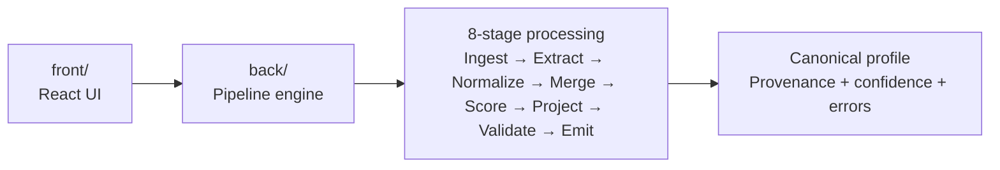

# Candidate Transformer

A **local-first candidate profile transformer** split into `front/` and `back/`:

- `front/` is the React UI.
- `back/` is the TypeScript pipeline engine and test suite.

It ingests heterogeneous candidate sources, runs them through an 8-stage deterministic pipeline, and emits a canonical profile that can be reshaped at runtime via a config editor.

---

## Features

| Feature | Details |
|---|---|
| **6 source types** | Recruiter CSV, ATS JSON, GitHub (REST API), LinkedIn JSON, Resume PDF, Plain-text recruiter notes |
| **8-stage pipeline** | Ingest → Extract → Normalize → Merge → Score → Project → Validate → Emit |
| **Confidence-weighted merge** | Per-field conflict resolution using source weight × field confidence |
| **Full provenance tracking** | Every field traces back to its origin source, raw value, and extraction method |
| **Runtime output reshaping** | JSON config editor reshapes output without rerunning code |
| **Split architecture** | `front/` UI + `back/` pipeline engine, both local to the repo |
| **Deterministic** | Same inputs, same output — always |

---

## Architecture



The `back/` folder contains the core data logic, while the `front/` folder focuses on uploads, results, config editing, and visual provenance.

### Stages

| # | Stage | What it does |
|---|---|---|
| 1 | **Ingest** | Reads files / fetches GitHub API. Returns `SourceBundle[]` |
| 2 | **Extract** | Source-specific parsers → `PartialCandidateRecord` |
| 3 | **Normalize** | Phone → E164, skill names → canonical, dates → YYYY-MM, country → ISO 3166 |
| 4 | **Merge** | Confidence-weighted dedup across sources → single `CandidateRecord` |
| 5 | **Score** | Computes `overall_confidence` from provenance coverage |
| 6 | **Project** | Applies `OutputConfig` to reshape final output |
| 7 | **Validate** | Checks required fields per config; reports `ValidationError`s |
| 8 | **Emit** | Stamps `pipeline_meta` and returns `PipelineResult` |

### Source Weights

| Source | Weight | Notes |
|---|---|---|
| ATS JSON | 0.95 | Most authoritative system record |
| CSV | 0.85 | Recruiter-managed export |
| LinkedIn | 0.80 | Self-reported but structured |
| GitHub | 0.70 | Inferred from activity |
| Resume | 0.75 | Applicant-provided resume PDF / text, parsed in the pipeline |
| Notes | 0.60 | Free text — lowest reliability |

---

## Quick Start

```bash
npm install
npm run dev
```

Open [http://localhost:5173](http://localhost:5173).

Click **Load Samples** and then **Run Pipeline** to see the full flow with demo data.

Do not start a separate backend process. The UI runs from `front/`, and it imports the pipeline engine from `back/` directly.

Useful commands:

```bash
npm test
npm run test:back
npm run build
```

If you only want the app running for the demo, `npm run dev` is the only process you need.

---

## Project Structure

```
front/
├── src/
│   ├── components/          UI shell, uploaders, results, config editor
│   ├── hooks/               Browser helpers
│   ├── store/               Zustand state + pipeline orchestration
│   ├── styles/              Theme tokens and animation utilities
│   └── main.tsx             React entrypoint
├── public/                  UI sample files and output config
└── index.html

back/
├── src/
│   ├── pipeline/            Ingest, extract, normalize, merge, score, project, validate
│   ├── identity/            Matching helpers
│   └── index.ts             Public exports for the engine
└── tests/                   Backend pipeline, extractor, and integration tests
```

---

## Output Config

The right panel contains a live JSON editor that shapes the projected output. Changes are validated in real time against the zod schema.

```json
{
  "fields": [
    { "path": "full_name",     "type": "string",   "required": true },
    { "path": "primary_email", "from": "emails[0]", "type": "string" },
    { "path": "phone",         "from": "phones[0]", "type": "string", "normalize": "E164" },
    { "path": "top_skills",    "from": "skills[].name", "type": "string[]" },
    { "path": "location",      "type": "object" }
  ],
  "include_confidence": true,
  "include_provenance": false,
  "on_missing": "omit"
}
```

### Field options

| Key | Type | Description |
|---|---|---|
| `path` | `string` | Output key name |
| `from` | `string` | Dot-path into canonical record (supports `field[0]`, `field[].nested`) |
| `type` | `string \| number \| boolean \| string[] \| object` | Declared type (informational) |
| `required` | `boolean` | If true + `on_missing: "error"`, throws instead of omitting |
| `normalize` | `"E164" \| "canonical" \| "ISO3166"` | Post-projection normalization |

### `on_missing` values

| Value | Behaviour |
|---|---|
| `"null"` (default) | Sets missing fields to `null` |
| `"omit"` | Excludes missing fields from output entirely |
| `"error"` | Throws `ProjectionError` for missing required fields |

---

## Running Tests

```bash
npm test
```

Tests use **Vitest** and cover:
- `resolveDotPath()` — 20+ cases (scalar, nested, indexed, spread)
- `project()` — field mapping, `on_missing` modes, remap via `from`, determinism
- `normalizePartialProfile()` — phone E164, skill canonicalization, country, dates
- `validateOutputConfig()` / `validateOutputConfigString()` — schema acceptance + rejection

---

## Tech Stack

| Layer | Choice | Reason |
|---|---|---|
| Framework | React 18 + Vite | Fast HMR, TS-first |
| State | Zustand | Minimal, no boilerplate |
| Styling | Tailwind CSS v3 | Utility-first, no component library |
| Validation | Zod | Runtime schema validation |
| Tests | Vitest | Co-located, native TS |
| Fonts | Inter + JetBrains Mono | Clean readable UI |

---

## Sample Inputs

Located in `front/public/sample_inputs/` for the UI and mirrored in `back/tests/fixtures/` for automated coverage:

| File | Source type |
|---|---|
| `recruiter_export.csv` | CSV (headers: name, email, phone, …) |
| `ats_blob.json` | ATS JSON (nested candidate object) |
| `linkedin_sample.json` | LinkedIn data export format |
| `recruiter_notes.txt` | Free-text recruiter email/notes |
| `resume_sample.pdf` | Resume PDF sample |

GitHub source uses `arjunsharma` as the demo username (public profile).

ATS JSON and resume PDF are handled in the engine, so they can be parsed, normalized, and validated before the frontend renders them.

## One Page Design

The design overview is in [ONE_PAGE_DESIGN_DOCUMENT.md](ONE_PAGE_DESIGN_DOCUMENT.md).

---

## Design Decisions

**Why split front/back instead of a single monolith?** The UI remains simple, but the pipeline logic is isolated in `back/` so it can be tested, explained, and evolved independently.

**Why Zustand over Redux?** This app has a single pipeline flow. Zustand's slice pattern gives all the reactivity needed without extra ceremony.

**Why confidence-weighted merge instead of last-write-wins?** Different sources have different reliability. ATS data (0.95) should win over recruiter notes (0.60) on name conflicts, but conflicts remain visible in provenance instead of being hidden.

**Why a live config editor?** Recruiters and engineers have different output requirements. Letting the output schema be defined at runtime avoids hardcoding every downstream format.

---

## License

MIT
